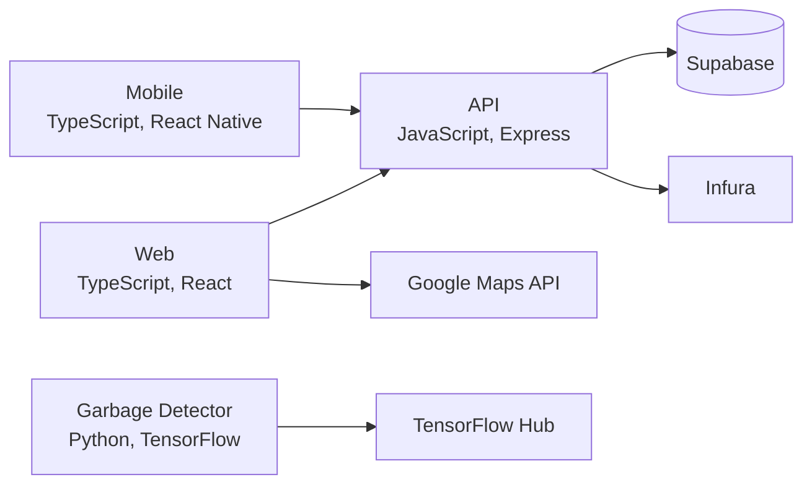

# compaist

Compaist is a composting app that helps people find shared compost bins on a map and rewards them with Sepolia testnet ETH for using them. Bin owners drop pins on a Google Map in the web app and get a QR code for each one, and scanning that code with the Expo mobile app records the visit and sends a small ETH payment from the owner's wallet to the visitor.

